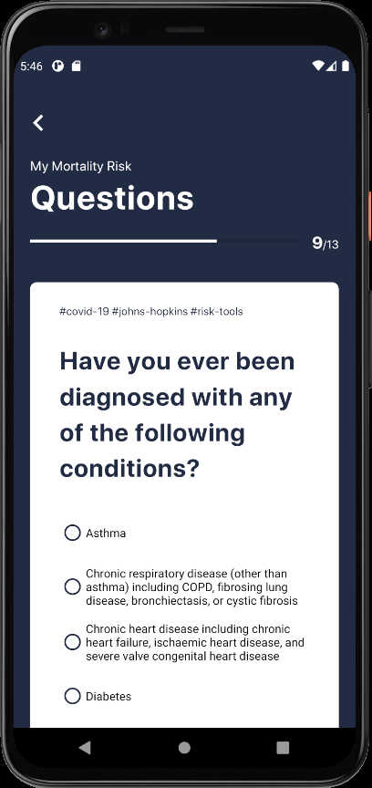

# COVID-19 Data Tracker and Death Risk Score

An Android application for visualizing current COVID-19 data and asserting individuals' death risk when infected with COVID-19 using various APIs and a systematic risk calculator developed by Johns Hopkins University.

## Data Sources

- [COVID19API](https://covid19api.com/), a free API for data on the Coronavirus sourced from [Johns Hopkins CSSE](https://github.com/CSSEGISandData/COVID-19).
- [The New York Times COVID-19 Data](https://github.com/nytimes/covid-19-data), a collection of COVID-19 Data gathered by The New York Times.
- [Data.CDC.gov](https://data.cdc.gov/), a collection of COVID-19 Vaccinations numbers for [Pfizer](https://data.cdc.gov/Vaccinations/COVID-19-Vaccine-Distribution-Allocations-by-Juris/saz5-9hgg), [Moderna](https://data.cdc.gov/Vaccinations/COVID-19-Vaccine-Distribution-Allocations-by-Juris/b7pe-5nws), and [Janssen](https://data.cdc.gov/Vaccinations/COVID-19-Vaccine-Distribution-Allocations-by-Juris/w9zu-fywh) vaccinations.
- [Risk tool](https://covid19risktools.com:8443/riskcalculator), a risk calculator tool that uses information on the risk for COVID-19 mortality associated with age, gender, race, social deprivation and 12 different health conditions published in a [recent large UK study](https://www.nature.com/articles/s41586-020-2521-4).

## Screen Shots

## Technologies Used

- Kotlin
- JavaScript
- Android Studio
- API
- D3.js
- XML
- HTML 
- CSS
